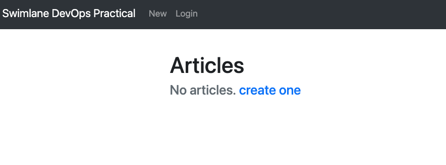
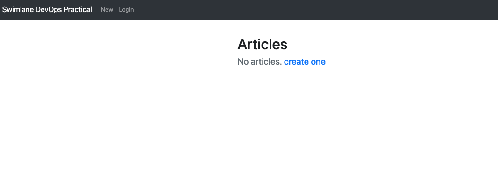
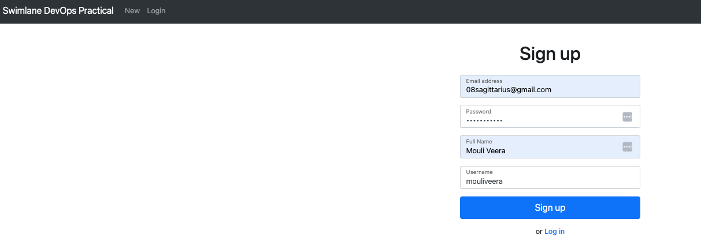
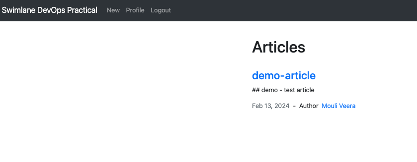

# Swimlane Infrastructure Practical

This README contains instructions and configurations for Dockerizing, deploying to a Kubernetes cluster, and using Helm to manage the deployment of the Swimlane Infrastructure Practical application.

## Dockerize

To Dockerize the Swimlane Infrastructure Practical application, follow these steps:

1. Clone the repository to your local machine:
   ```
   git clone https://github.com/swimlane/devops-practical
   ```

2. Navigate to the `node-app/devops-practical` directory.

3. Create Dockerfiles for both the node app and MongoDB. Example Dockerfiles can be found in the respective directories.

4. Build the Docker images:
   ```
   docker build -t devops-practical-app:latest . -f Dockerfile
   docker build -t mongo:latest . -f mongo/Dockerfile
   ```

5. Test the application functionality by using a Docker Compose file (`docker-compose.yml`) with environment variables.

6. Run the application with Docker Compose:
   ```
   cd node-app/devops-practical
   docker-compose up -d
   ```

7. Access the application locally at `https://localhost:3000` in your web browser.



---
## Kubernetes Cluster

To deploy the application to a Kubernetes cluster.

1. Configured Minikube locally:
   ```
   minikube start
   ```

2. Set up the local Docker environment for Minikube: Images are not pushed to Container registry. To use the images that we build on Docker desktop.
   ```
   eval $(minikube docker-env)
   ```

3. Create Manifest files for Kubernetes deployment in the `K8s-manifests/devops-practical-app` directory.

4. Create a namespace for the deployment:
   ```
   kubectl create ns demo
   ```

5. Apply the manifests to the demo namespace:
   ```
   kubectl apply -f K8s-manifests/devops-practical-app -n demo
   ```

6. Verify deployed Kubernetes resources:
   ```
   ❯ k get all -n demo
NAME                                        READY   STATUS    RESTARTS   AGE
pod/devops-practical-app-67489bd68c-h8dgl   1/1     Running   0          7m19s
pod/devops-practical-app-67489bd68c-t87f2   1/1     Running   0          19m
pod/mongo-0                                 1/1     Running   0          19m
pod/mongo-1                                 1/1     Running   0          7m19s
pod/mongo-2                                 1/1     Running   0          7m16s

NAME                           TYPE        CLUSTER-IP      EXTERNAL-IP   PORT(S)     AGE
service/devops-practical-app   ClusterIP   10.107.11.43    <none>        3000/TCP    19m
service/mongo                  ClusterIP   10.100.249.93   <none>        27017/TCP   19m

NAME                                   READY   UP-TO-DATE   AVAILABLE   AGE
deployment.apps/devops-practical-app   2/2     2            2           19m

NAME                                              DESIRED   CURRENT   READY   AGE
replicaset.apps/devops-practical-app-67489bd68c   2         2         2       19m

NAME                     READY   AGE
statefulset.apps/mongo   3/3     19m
   ```

7. Access the application locally by port-forwarding:
   ```
   kubectl port-forward svc/devops-practical-app -n demo 3000:3000
   ```

8. Open your browser and go to `http://127.0.0.1:3000` to access the application.


## Helm Deployment

To deploy the application using Helm, follow these steps:

1. Create a new namespace for Helm chart testing:
   ```
   kubectl create ns dev
   ```

2. Create a Helm chart named `devops-practical-chart`:
   ```
   helm create devops-practical-chart
   ```

3. Customize the Helm chart templates to match the requirements.

4. Test the Helm chart using `helm template`:
   ```
   helm template swimlate . -f values.yaml -n dev
   ```

5. Install the Helm chart:
   ```
   ❯ helm install swimlate . -f values.yaml -n dev
NAME: swimlate
LAST DEPLOYED: Tue Feb 13 13:49:04 2024
NAMESPACE: dev
STATUS: deployed
REVISION: 1
TEST SUITE: None
NOTES:
1. Get the application URL by running these commands:
  export POD_NAME=$(kubectl get pods --namespace dev -l "app.kubernetes.io/name=devops-practical-chart,app.kubernetes.io/instance=swimlate" -o jsonpath="{.items[0].metadata.name}")
  export CONTAINER_PORT=$(kubectl get pod --namespace dev $POD_NAME -o jsonpath="{.spec.containers[0].ports[0].containerPort}")
  echo "Visit http://127.0.0.1:8080 to use your application"
  kubectl --namespace dev port-forward $POD_NAME 8080:$CONTAINER_PORT
   ```

6. Verify the deployment:
   ```
   ❯ kubectl get all -n dev
NAME                                                  READY   STATUS    RESTARTS   AGE
pod/swimlate-devops-practical-chart-9d8c844b5-k8rfk   1/1     Running   0          91s
pod/swimlate-devops-practical-chart-9d8c844b5-rqrb5   1/1     Running   0          91s
pod/swimlate-devops-practical-chart-mongodb-0         1/1     Running   0          91s
pod/swimlate-devops-practical-chart-mongodb-1         1/1     Running   0          86s
pod/swimlate-devops-practical-chart-mongodb-2         1/1     Running   0          82s

NAME                                      TYPE        CLUSTER-IP       EXTERNAL-IP   PORT(S)     AGE
service/swimlate-devops-practical-chart   ClusterIP   10.103.109.107   <none>        3000/TCP    91s
service/swimlate-mongodb                  ClusterIP   10.96.32.226     <none>        27017/TCP   91s

NAME                                              READY   UP-TO-DATE   AVAILABLE   AGE
deployment.apps/swimlate-devops-practical-chart   2/2     2            2           91s

NAME                                                        DESIRED   CURRENT   READY   AGE
replicaset.apps/swimlate-devops-practical-chart-9d8c844b5   2         2         2       91s

NAME                                                       READY   AGE
statefulset.apps/swimlate-devops-practical-chart-mongodb   3/3     91s

NAME                                                                  REFERENCE                                    TARGETS         MINPODS   MAXPODS   REPLICAS   AGE
horizontalpodautoscaler.autoscaling/swimlate-devops-practical-chart   Deployment/swimlate-devops-practical-chart   <unknown>/80%   2         4         2          91s

   ```

7. Port forward to access the Swimlane app:
   ```
   kubectl port-forward svc/swimlate-devops-practical-chart -n dev 3001:3000
   ```

8. Open your browser and go to `http://127.0.0.1:3000` to access the application.





9. Demo article

