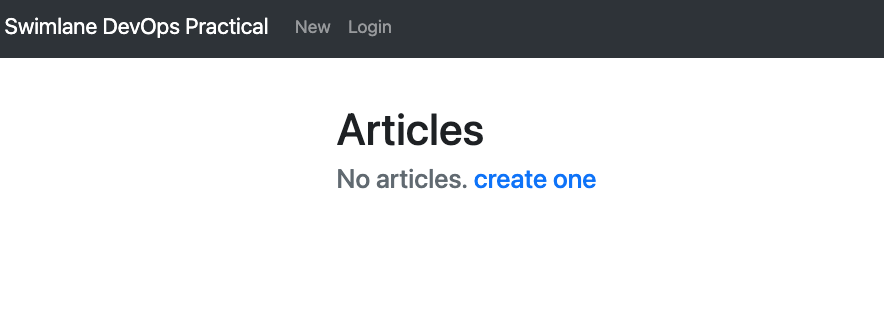
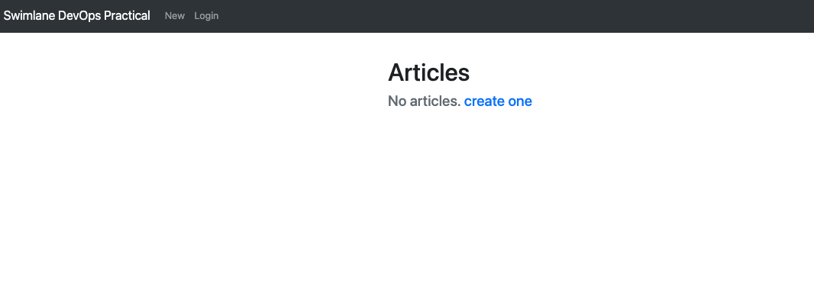
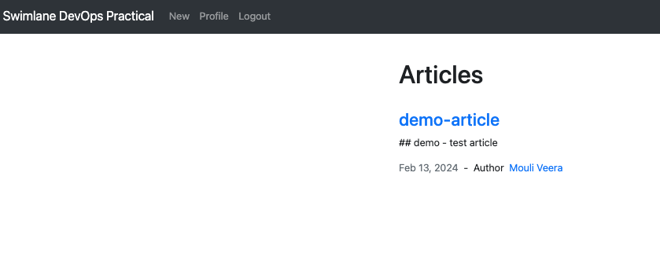

# Swimlane Infrastructure Practical
## Dockerize
- Cloned https://github.com/swimlane/devops-practical to my local.
- Created Dockerfile for the node app. File location: `devops-practical/Dockerfile`
- Created an image.
```
docker build -t devops-practical-app:latest . -f Dockerfile
```
- Createa a Dockerfile for mongo as we need it for nod app. File location: `devops-practical/mongo/Dockerfile`
- Created an image.
```
docker build -t mongo:latest . -f mongo/Dockerfile
```
- To test the app functionality, I created a compose file: devops-practical/docker-compose.yml with ENV variables. Sharing it here for the reference.
- Switch to devops-practical folder[cd devops-practical] and use *docker-compose up -d* to access https://localhost:3000 on you local web browser.

## Kubernetes cluster
- I have configured Minikube locally: `minikube start`.
- Images are not pushed to Container registry. To use the images that we build on Docker desktop: `eval $(minikube docker-env)`.
- Create Manifest files[folder Location: K8s/devops-practical-app].
- Create a demo namespace to deploy them.
```
kubectl create ns demo
namespace/demo created
```
- Applied the manifests to demo namespace.
```
kubectl apply -f K8s/devops-practical-app -n demo
```
- List the kubernetes resources to validate.
```
❯ k get all -n demo
NAME                                        READY   STATUS    RESTARTS   AGE
pod/devops-practical-app-67489bd68c-h8dgl   1/1     Running   0          7m19s
pod/devops-practical-app-67489bd68c-t87f2   1/1     Running   0          19m
pod/mongo-0                                 1/1     Running   0          19m
pod/mongo-1                                 1/1     Running   0          7m19s
pod/mongo-2                                 1/1     Running   0          7m16s

NAME                           TYPE        CLUSTER-IP      EXTERNAL-IP   PORT(S)     AGE
service/devops-practical-app   ClusterIP   10.107.11.43    <none>        3000/TCP    19m
service/mongo                  ClusterIP   10.100.249.93   <none>        27017/TCP   19m

NAME                                   READY   UP-TO-DATE   AVAILABLE   AGE
deployment.apps/devops-practical-app   2/2     2            2           19m

NAME                                              DESIRED   CURRENT   READY   AGE
replicaset.apps/devops-practical-app-67489bd68c   2         2         2       19m

NAME                     READY   AGE
statefulset.apps/mongo   3/3     19m
```

- Access APP locally by doing port-forward
```
kubectl port-forward svc/devops-practical-app -n demo 3000:3000
```

- open your browser to access http://127.0.0.1:3000/



## Helm to deploy the manifests

- Create a new namespace for helm chart testing
```
kubectl create ns dev
```
- Created a Helm  chart "HelmCharts/devops-practical-chart"
```
helm create devops-practical-chart
```
- Adjusted templated yamls to fullfill the ask.
- Used "helm template" to test manufest files.
```
helm template swimlate . -f values.yaml -n dev
```
- Helm Install
```
❯ helm install swimlate . -f values.yaml -n dev
NAME: swimlate
LAST DEPLOYED: Tue Feb 13 13:49:04 2024
NAMESPACE: dev
STATUS: deployed
REVISION: 1
TEST SUITE: None
NOTES:
1. Get the application URL by running these commands:
  export POD_NAME=$(kubectl get pods --namespace dev -l "app.kubernetes.io/name=devops-practical-chart,app.kubernetes.io/instance=swimlate" -o jsonpath="{.items[0].metadata.name}")
  export CONTAINER_PORT=$(kubectl get pod --namespace dev $POD_NAME -o jsonpath="{.spec.containers[0].ports[0].containerPort}")
  echo "Visit http://127.0.0.1:8080 to use your application"
  kubectl --namespace dev port-forward $POD_NAME 8080:$CONTAINER_PORT
```

- List the Kubernetes resources created/running.
```
❯ kubectl get all -n dev
NAME                                                  READY   STATUS    RESTARTS   AGE
pod/swimlate-devops-practical-chart-9d8c844b5-k8rfk   1/1     Running   0          91s
pod/swimlate-devops-practical-chart-9d8c844b5-rqrb5   1/1     Running   0          91s
pod/swimlate-devops-practical-chart-mongodb-0         1/1     Running   0          91s
pod/swimlate-devops-practical-chart-mongodb-1         1/1     Running   0          86s
pod/swimlate-devops-practical-chart-mongodb-2         1/1     Running   0          82s

NAME                                      TYPE        CLUSTER-IP       EXTERNAL-IP   PORT(S)     AGE
service/swimlate-devops-practical-chart   ClusterIP   10.103.109.107   <none>        3000/TCP    91s
service/swimlate-mongodb                  ClusterIP   10.96.32.226     <none>        27017/TCP   91s

NAME                                              READY   UP-TO-DATE   AVAILABLE   AGE
deployment.apps/swimlate-devops-practical-chart   2/2     2            2           91s

NAME                                                        DESIRED   CURRENT   READY   AGE
replicaset.apps/swimlate-devops-practical-chart-9d8c844b5   2         2         2       91s

NAME                                                       READY   AGE
statefulset.apps/swimlate-devops-practical-chart-mongodb   3/3     91s

NAME                                                                  REFERENCE                                    TARGETS         MINPODS   MAXPODS   REPLICAS   AGE
horizontalpodautoscaler.autoscaling/swimlate-devops-practical-chart   Deployment/swimlate-devops-practical-chart   <unknown>/80%   2         4         2          91s

```

- We have not enabled ingress, and used "ClusterIP" for service type.
- Port forward to access swimlane app.
```
kubectl port-forward svc/swimlate-devops-practical-chart -n dev 3001:3000
```
- Open your browser to access http://127.0.0.1:3000/



- Demo article
